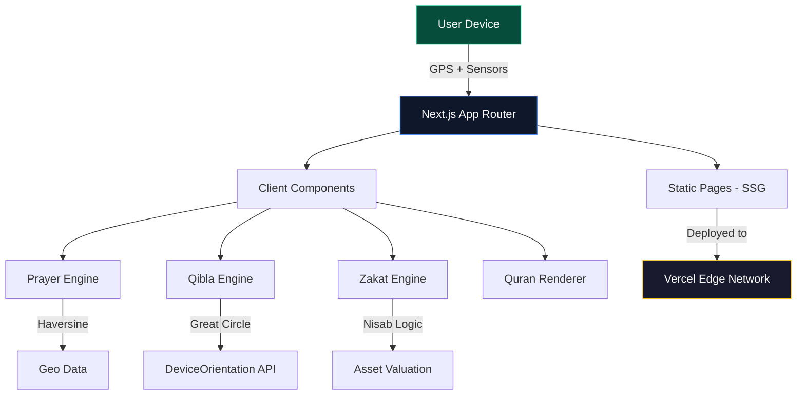

<div align="center">

<!-- Animated Header Wave -->


<!-- Typing Animation -->
<a href="https://git.io/typing-svg"></a>

<br />

<!-- Animated Badges -->


<br /><br />

<!-- Star / Fork / Issues Badges -->
<a href="https://github.com/sovon1/noor/stargazers"></a>
&nbsp;
<a href="https://github.com/sovon1/noor/network/members"></a>
&nbsp;
<a href="https://github.com/sovon1/noor/issues"></a>

</div>

<br />

<!-- Animated Divider -->


<br />

##  &nbsp;What is Noakhali Noor?

**নোয়াখালীর নূর (Noakhali Noor)** is a blazing-fast, offline-capable **Progressive Web App** engineered for the Muslim community of **Noakhali District, Bangladesh**. It delivers hyper-localized Ramadan utilities — from precise Sehri/Iftar countdowns to a real-time Qibla compass — wrapped in a cinematic, glassmorphism UI.

> _"Technology in service of faith."_

<br />

##  &nbsp;Feature Overview

<div align="center">

```
┌─────────────────────────────────────────────────────────────┐
│                    🌙 NOAKHALI NOOR                         │
├─────────────┬───────────────┬───────────────┬───────────────┤
│  ⏱️ Smart    │  📅 Ramadan   │  🕋 5-Waqt    │  📍 Auto      │
│  Countdown  │  Calendar     │  Prayer Times │  Location     │
├─────────────┼───────────────┼───────────────┼───────────────┤
│  🧭 Qibla    │  💰 Zakat     │  📖 Quran     │  📿 Digital   │
│  Compass    │  Calculator   │  Reader       │  Tasbeeh      │
├─────────────┼───────────────┼───────────────┼───────────────┤
│  🤲 Duas &   │  🕌 Mosque    │  ⚡ PWA       │  🌑 Dark      │
│  Tasbeeh    │  Finder       │  Offline      │  Mode UI      │
└─────────────┴───────────────┴───────────────┴───────────────┘
```

</div>

<br />

<details>
<summary><b>🎯 Core Modules — Click to expand</b></summary>

<br />

| Module | Description | Tech Used |
|:---|:---|:---|
| **⏱️ Sehri/Iftar Countdown** | Real-time countdown timer with Bangla numerals, auto-updates every second | `setInterval`, `date-fns` |
| **📅 Ramadan Calendar** | Full 30-day calendar with today-highlighting and Sehri/Iftar for each day | Static data + dynamic rendering |
| **🕋 Prayer Times** | 5-waqt Salah schedule for all 9 Upazilas of Noakhali | Pre-computed astronomical data |
| **📍 Geolocation** | Auto-detects nearest Upazila using `navigator.geolocation` | Haversine formula |
| **🧭 Qibla Compass** | Animated compass needle pointing to Kaaba (21.4225°N, 39.8262°E) | `DeviceOrientationEvent`, spherical trig |
| **💰 Zakat Calculator** | Asset-based calculator with Nisab threshold (Gold/Silver standard) | Custom financial logic |
| **📖 Quran Reader** | Surah list → detail view with Arabic, Bangla, English | `AnimatePresence` transitions |
| **📿 Digital Tasbeeh** | Counter with vibration feedback, save/load, progress visualization | `navigator.vibrate()` |
| **🤲 Duas Collection** | Categorized Duas with Arabic text, transliteration, and meaning | Tabbed UI with search |
| **🕌 Mosque Finder** | Interactive Leaflet map with mosque markers and directions | `react-leaflet` |

</details>

<br />

<!-- Animated Divider -->


<br />

##  &nbsp;Architecture



<br />

## 🛠️ Tech Stack Deep Dive

<div align="center">

<table>
<tr>
<td align="center" width="120">

<br /><b>Next.js 15</b>
<br /><sub>App Router</sub>
</td>
<td align="center" width="120">

<br /><b>React 19</b>
<br /><sub>Server Components</sub>
</td>
<td align="center" width="120">

<br /><b>TypeScript</b>
<br /><sub>Type Safety</sub>
</td>
<td align="center" width="120">

<br /><b>Tailwind 4</b>
<br /><sub>Utility-First CSS</sub>
</td>
<td align="center" width="120">

<br /><b>Vercel</b>
<br /><sub>Edge Deploy</sub>
</td>
</tr>
</table>

</div>

<br />

<!-- Animated Divider -->


<br />

## ⚡ Quick Start

```bash
# Clone
git clone https://github.com/sovon1/noor.git && cd noor

# Install
npm install

# Dev Server
npm run dev

# Production Build
npm run build
```

> **Tip:** The app runs at `http://localhost:3000`. On mobile, visit your PC's local IP to test PWA install.

<br />

## 📂 Project Layout

```
noor/
├── 📁 public/                  # Static assets & PWA manifest
├── 📁 src/
│   ├── 📁 app/                 # Next.js App Router
│   │   ├── 📄 page.tsx         # Home — countdown, quick links
│   │   ├── 📄 layout.tsx       # Root layout — nav, footer
│   │   ├── 📁 prayer-times/    # 5-waqt salah schedule
│   │   ├── 📁 ramadan-calendar/# 30-day Ramadan overview
│   │   ├── 📁 quran/           # Surah reader
│   │   ├── 📁 duas-tasbeeh/    # Duas + digital tasbeeh
│   │   ├── 📁 mosques/         # Mosque map & finder
│   │   ├── 📁 zakat/           # Zakat calculator
│   │   └── 📁 qibla/           # Qibla compass
│   ├── 📁 data/                # Static datasets
│   │   ├── 📄 prayer-times.ts  # Upazila-wise prayer data
│   │   ├── 📄 duas.ts          # Duas & tips collection
│   │   ├── 📄 quran.ts         # Surah metadata & ayahs
│   │   └── 📄 mosques.ts       # Mosque locations
│   └── 📁 lib/
│       └── 📄 utils.ts         # Shared utilities
├── 📄 next.config.ts           # SSG + image config
├── 📄 tailwind.config.ts       # Theme customization
└── 📄 package.json
```

<br />

## 🤝 Contributing

Contributions, issues, and feature requests are welcome!

```bash
# Fork → Branch → Commit → Push → PR
git checkout -b feat/amazing-feature
git commit -m "feat: add amazing feature"
git push origin feat/amazing-feature
```

<br />

<!-- Animated Divider -->


<br />

<div align="center">

### 💚 Built with passion by [Sovon](https://github.com/sovon1)

<br />


</div>
